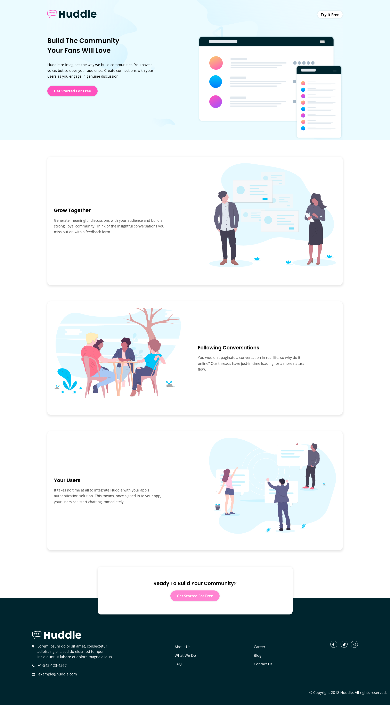

# Frontend Mentor - Huddle landing page with alternating feature blocks solution

This is a solution to the [Huddle landing page with alternating feature blocks challenge on Frontend
Mentor](https://www.frontendmentor.io/challenges/huddle-landing-page-with-alternating-feature-blocks-5ca5f5981e82137ec91a5100).
Frontend Mentor challenges help you improve your coding skills by building realistic projects. 

## Table of contents

- [Overview](#overview)
  - [The challenge](#the-challenge)
  - [Screenshot](#screenshot)
  - [Links](#links)
- [My process](#my-process)
  - [Built with](#built-with)
  - [What I learned](#what-i-learned)
  - [Useful resources](#useful-resources)

### Screenshot




### Links

- Solution URL: [Solution](https://www.frontendmentor.io/solutions/huddlelandingpagewithalternatingfeatureblocks-mobile-first-tLNb1NlxR)
- Live Site URL: [Live Site](https://huddle-landing-page-with-alternating-feature-blocks-one.vercel.app/)

## My process

### Built with

- Semantic HTML5 markup
- CSS custom properties
- Flexbox
- CSS Grid
- Mobile-first workflow

### What I learned

 - Transition on hover
 
 ```css
    .link:after {
      content: "";
      position: absolute;
      top: 100%;
      height: 2px;
      background-color: blue;
      
      /* positioning the cursor at the middle i.e 0 length */
      left: 100%;
      right: 100%
      
      /* animation definition */
      transform: all 300ms ease-in-out;
    }
    
  a:hover::after {
     /* final position of the cursors after the animation */
    left: 0;
    right: 0;
  }
 ```
